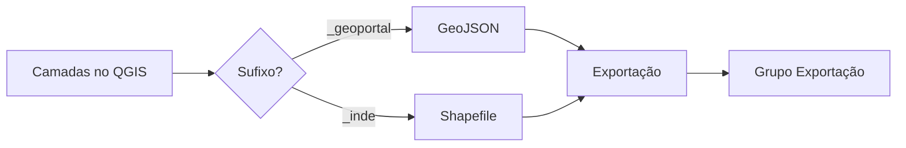

# 🚀 Exportador de Camadas QGIS

Plugin para QGIS 3 que automatiza a exportação de camadas baseado em sufixos, suportando GeoJSON e Shapefile com interface intuitiva.

[](https://qgis.org/)
[](https://www.python.org/)
[](LICENSE)
[]()

---

## 📋 Índice

- [✨ Funcionalidades](#-funcionalidades)
- [🎯 Como Funciona](#-como-funciona)
- [📥 Instalação](#-instalação)
- [🚀 Uso](#-uso)
- [📁 Estrutura do Projeto](#-estrutura-do-projeto)
- [⚙️ Configuração](#️-configuração)
- [🤝 Contribuição](#-contribuição)
- [📝 Licença](#-licença)
- [👨‍💻 Autor](#-autor)

---

## ✨ Funcionalidades

- 🔍 **Detecção automática** de camadas por sufixo
- 📤 **Exportação em lote** para GeoJSON e Shapefile
- 🖥️ **Interface intuitiva** para revisão antes da exportação
- ✏️ **Nomes personalizáveis** dos arquivos de saída
- 📂 **Organização automática** em pastas
- 🎨 **Toolbar personalizável** no QGIS
- 📊 **Adição automática** das camadas exportadas ao projeto
- 🔄 **Modo automático** para exportação rápida
- 📍 **Suporte a CRS** com transformação automática

---

## 🎯 Como Funciona

O plugin identifica camadas pelos sufixos no nome:

| Sufixo | Formato de Saída | Exemplo |
|--------|-----------------|---------|
| `*_geoportal` | 🌐 **GeoJSON** (.geojson) | `areas_risco_geoportal` → `areas_risco.geojson` |
| `*_inde` | 📦 **Shapefile** (.shp) | `limites_municipais_inde` → `limites_municipais.shp` |

### 🔄 Fluxo de Trabalho



---

## 📥 Instalação

### Método 1: Instalação Direta (Recomendado)

1. 📂 Navegue até a pasta de plugins do QGIS:
   - **Windows**: `C:\Users\SEU_USUARIO\AppData\Roaming\QGIS\QGIS3\profiles\default\python\plugins\`
   - **Linux**: `~/.local/share/QGIS/QGIS3/profiles/default/python/plugins/`
   - **Mac**: `~/Library/Application Support/QGIS/QGIS3/profiles/default/python/plugins/`

2. 📥 Clone ou baixe o repositório:
   ```bash
   git clone https://github.com/SEU_USUARIO/exportador-camadas-qgis.git exportador_camadas
   ```

3. 🔄 Reinicie o QGIS

4. ✅ Ative o plugin em: **Complementos → Gerenciar e Instalar Complementos**

### Método 2: ZIP

1. 📦 Baixe o arquivo ZIP do repositório
2. 📂 Extraia na pasta de plugins do QGIS
3. 🔄 Reinicie o QGIS
4. ✅ Ative o plugin

---

## 🚀 Uso

### 🖥️ Modo Revisão (Recomendado)

1. Clique no ícone 🧩 na barra de ferramentas ou acesse: **Exportador de Camadas → Revisar e Exportar Camadas**

2. Na janela que abrir:
   - ✅ Selecione/desselecione camadas para exportar
   - ✏️ Edite os nomes dos arquivos de saída
   - 🔄 Altere o formato se necessário
   - 📁 Escolha o diretório de destino

3. Clique em **✅ Exportar Camadas**

### ⚡ Modo Automático

- **Exportar Todas**: Processa todas as camadas do projeto
- **Exportar Selecionadas**: Processa apenas camadas selecionadas no painel

### 📊 Resultado

Após a exportação, as camadas serão automaticamente adicionadas ao projeto em um grupo chamado **"Exportação"**:

```
📁 Camadas
  📁 Exportação
    📄 areas_risco (GeoJSON)
    📄 limites_municipais (Shapefile)
    📄 rodovias (GeoJSON)
```

---

## 📁 Estrutura do Projeto

```
exportador_camadas/
├── 📄 __init__.py                      # Inicialização do plugin
├── 🎯 exportador_camadas.py            # Código principal
├── 🖥️ exportador_camadas_dialog.py     # Interface de diálogo
├── 🎨 exportador_dialog.ui             # Layout da interface
├── 📋 metadata.txt                     # Metadados do plugin
├── 🖼️ icon.png                         # Ícone do plugin
└── 📖 README.md                        # Este arquivo
```

---

## ⚙️ Configuração

### Personalizar Toolbar

1. Clique com botão direito na barra de ferramentas do QGIS
2. Marque/desmarque **"Exportador de Camadas"**
3. Arraste os botões para reorganizar

### Atalhos de Teclado

Você pode configurar atalhos em: **Configurações → Atalhos de Teclado**

---

## 🤝 Contribuição

Contribuições são bem-vindas! 🎉

### Como Contribuir

1. 🍴 Faça um Fork do projeto
2. 🌿 Crie uma Branch (`git checkout -b feature/NovaFuncionalidade`)
3. 💾 Commit suas mudanças (`git commit -m 'Adiciona nova funcionalidade'`)
4. 📤 Push para a Branch (`git push origin feature/NovaFuncionalidade`)
5. 🔄 Abra um Pull Request

### Reportar Bugs

Encontrou um bug? Abra uma [Issue](https://github.com/exportar_camadas_plugin_qgis/issues) com:
- 📝 Descrição detalhada
- 🔢 Versão do QGIS
- 🖥️ Sistema Operacional
- 📸 Screenshots (se possível)

---

## 📝 Licença

Este projeto está sob a licença MIT. Veja o arquivo [LICENSE](LICENSE) para mais detalhes.

```
MIT License

Copyright (c) 2024 Seu Nome

Permission is hereby granted, free of charge...
```

---

## 👨‍💻 Autor

**Rogerio Vidal de Siqueira**

[](https://github.com/rvidals)
[]([https://linkedin.com/in/SEU_PERFIL](https://www.linkedin.com/in/rogerio-vidal-de-siqueira-9478aa136/?isSelfProfile=false))
[](mailto:rogeriovidalsiqueira@email.com)

---

## 🌟 Agradecimentos

- 🗺️ Comunidade QGIS
- 🐍 Python e PyQGIS
- 💡 Contribuidores e usuários

<div align="center">
  <sub>Feito com ❤️ para a comunidade GIS</sub>
</div>
```
